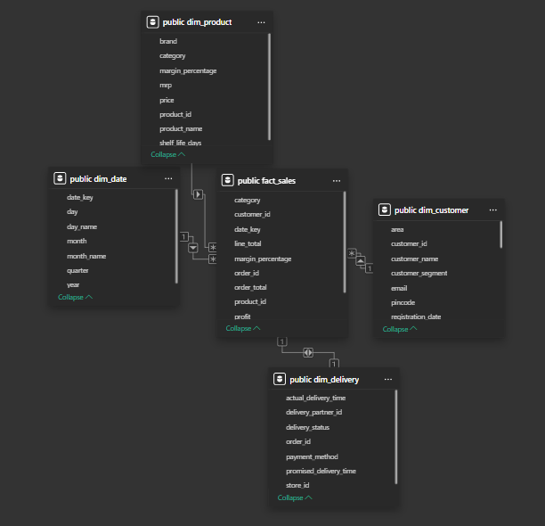
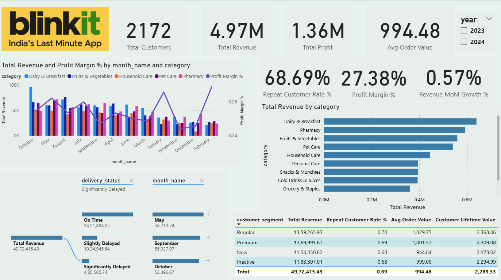

# BlinkIt Business Performance Analysis (SQL + Power BI)


## 📌 Project Context (Situation)
BlinkIt operates in a **high-frequency, quick-commerce environment** where growth alone is not enough —  
**customer quality, operational reliability, and realized revenue** matter more than raw order volume.

Leadership faced a core challenge:

> *"Are our customers, products, marketing channels, and delivery operations truly driving sustainable business value — or are we just growing numbers?"*

This project was built to **answer that question using data**, not assumptions.

---

## 🎯 Objective (Task)
The goal of this project was to:

- Identify **high-value vs low-value customers**
- Evaluate whether **top products create operational risk**
- Assess **delivery reliability as a growth constraint**
- Measure **marketing effectiveness based on customer quality**
- Detect **value leakage across the order → delivery funnel**

The analysis needed to be:
- SQL-driven
- Decision-oriented
- Executable at scale
- Suitable for executive decision-making

---

## 🛠 Data & Modeling Approach (Action)

### 🔹 Data Model (Star Schema)
A **star schema** was designed for analytics and reporting in **Power BI**, separating facts from context.



#### Fact Table
- **`fact_orders`**
  - Order-level transactional data
  - Revenue, quantity, product, category, customer, and geography

#### Supporting Tables / Views
- **`delivery_metrics` (VIEW)** – delivery result, time, distance  
- **`marketing_performance`** – customer acquisition channel  

This structure mirrors **real-world data warehouse design**, enabling:
- Fast aggregation
- Clean joins
- Business-friendly metrics

---

## 🔍 Business Questions & Analysis

### Q1️⃣ Customer Economics & Retention  
**Problem:**  
Are all high-revenue customers equally valuable?

**Analysis:**  
SQL aggregation was used to measure:
- Total revenue per customer
- Order frequency
- Average order value
- Delivery issue rate

**Finding:**  
Top revenue customers show **zero delivery issues**, making them ideal for retention and loyalty strategies.  
Low-value and one-time customers contribute limited long-term value.

---

### Q2️⃣ Product Portfolio Health  
**Problem:**  
Do top-selling products introduce delivery or operational risk?

**Analysis:**  
Products were evaluated on:
- Orders
- Revenue
- Units sold
- Delivery issue rate

**Finding:**  
High-performing products exhibit **stable delivery performance**.  
Revenue is driven by **balanced, reliable SKUs**, not fragile high-risk products.

---

### Q3️⃣ Product Sales Efficiency (Revenue vs Volume)  
**Problem:**  
Which products depend on volume vs value?

**Analysis:**  
Revenue per unit was calculated to segment products into:
- High-value / low-volume
- Balanced performers
- Low-value / high-volume

**Finding:**  
Most products fall into a **balanced efficiency zone**, supporting sustainable revenue without extreme pricing or volume dependency.

---

### Q4️⃣ Delivery Performance & Reliability  
**Problem:**  
Is delivery reliability limiting growth?

**Analysis:**  
Daily delivery performance was analyzed using:
- Delivery success rate
- Average delivery time
- Distance

**Finding:**  
Delivery performance is **consistently strong** with minimal failures.  
Operations are currently a **strength**, not a bottleneck.

---

### Q5️⃣ Marketing Effectiveness & Customer Quality  
**Problem:**  
Are marketing channels acquiring valuable customers?

**Analysis:**  
Customers were evaluated post-acquisition on:
- Orders per customer
- Revenue per customer
- Average order value

**Finding:**  
Marketing channels vary significantly in **customer quality**.  
Some channels drive repeat, high-value customers, while others inflate volume without long-term value.

---

### Q6️⃣ End-to-End Funnel Performance  
**Problem:**  
Is revenue lost between order placement and delivery?

**Analysis:**  
Order and delivery stages were compared to calculate:
- Delivery success rate
- Realized vs potential revenue

**Finding:**  
The funnel shows **minimal value leakage**.  
Revenue generated at checkout is largely realized operationally.

---

## 📊 Dashboard (Power BI)



A **Power BI dashboard** was built on the star schema to:
- Visualize customer segments
- Track product performance
- Monitor delivery reliability
- Compare marketing channels
- Present an executive funnel view

The dashboard complements SQL analysis and enables **non-technical stakeholders** to explore insights interactively.

---

## ✅ Impact (Result)

### Business-Level Outcomes
- Identified **high-value customers** worth prioritizing for retention
- Confirmed **delivery reliability as a competitive advantage**
- Highlighted **marketing channels that drive quality vs noise**
- Validated that growth is **realized, not lost downstream**

### Analytical Value
- Demonstrated end-to-end SQL analysis
- Applied star schema modeling
- Aligned insights with actual data (no forced narratives)
- Followed a professional analytics workflow

---

## 🧪 Data Validation
Before analysis, data sanity checks were performed to validate:
- Table availability
- Key integrity
- Null handling
- Date ranges
- Join consistency

This ensured all conclusions were built on **trustworthy data**.

---

## 🧰 Tools & Workflow
| Tool | Purpose |
|------|---------|
| **PostgreSQL** | Database & SQL query execution |
| **Python** | Data import & setup automation |
| **VS Code** | SQL development environment |
| **pgAdmin** | Query validation & debugging |
| **Power BI** | Business intelligence & visualization |
| **GitHub** | Version control & project documentation |

---

## 🚀 Author
Built by **Veda Vedhya**  
Focused on SQL analytics, data modeling, and business-driven insights.

---

## 📂 Project Structure
```
blinkit-sql-analysis/
│
├── blinkit-sql-analysis/          # Main analysis folder
│   ├── analysis/                  # SQL analysis queries
│   │   ├── 01_data_sanity_checks.sql
│   │   ├── 02_customer_economics.sql
│   │   ├── 03_product_portfolio.sql
│   │   ├── 04_product_sales_efficiency.sql
│   │   ├── 05_delivery_performance.sql
│   │   ├── 06_marketing_effectiveness.sql
│   │   └── 07_end_to_end_funnel.sql
│   │
│   ├── insights/                  # Business insights documentation
│   │   ├── customer_insights.md
│   │   ├── product_insights.md
│   │   ├── sales_efficiency_insights.md
│   │   ├── delivery_insights.md
│   │   ├── marketing_insights.md
│   │   └── executive_summary.md
│   │
│   ├── data_model/               # Data modeling documentation
│   │   └── table_relationships.md
│   │
│   ├── schema/                   # Database schema diagrams
│   │   ├── star-schema.png
│   │   └── er_diagram.png
│   │
│   └── assets/                   # Visualizations & exports
│       └── charts_or_exports/
│           └── DASHBOARD.png
│
├── raw_data/                     # Raw data files
│
├── blinkit-dashboard.pbix        # Power BI dashboard file
├── importing_data_postgres.sql   # Database setup script
├── setup.py                      # Python setup automation
├── .gitignore                    # Git ignore configuration
├── LICENSE                       # Project license
└── README.md                     # Project documentation
```

---

## 🏁 Getting Started

### Prerequisites
- PostgreSQL 12+
- Python 3.8+
- Power BI Desktop
- pgAdmin (optional)

### Setup Instructions
1. **Clone the repository**
```bash
   git clone https://github.com/yourusername/blinkit-sql-analysis.git
   cd blinkit-sql-analysis
```

2. **Set up the database**
```bash
   python setup.py
   # OR manually run:
   psql -U your_username -d your_database -f importing_data_postgres.sql
```

3. **Run SQL analysis**
   - Navigate to `blinkit-sql-analysis/analysis/`
   - Execute queries in order (01 through 07)
   - Review results and insights

4. **Open Power BI Dashboard**
   - Open `blinkit-dashboard.pbix` in Power BI Desktop
   - Refresh data connections if needed
   - Explore interactive visualizations

---

## 📧 Contact
For questions or collaboration opportunities, reach out via:
- **GitHub:** VEDA-2402
- **LinkedIn:** https://www.linkedin.com/in/veda-t-8b9a7134a/
- **Email:** veda.vedhya240205example.com
